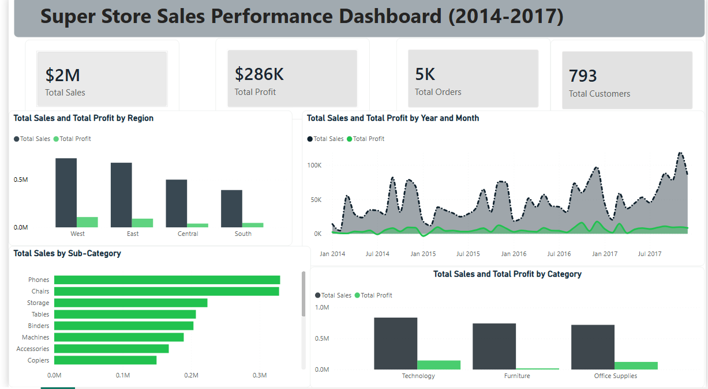

# Superstore Sales Performance Dashboard

Analysis of 9,994 retail order lines (2014–2017, United States) to identify where the business makes money, where it doesn't, and why.

**Tools used:** Excel (Power Query cleaning) → SQL (business-question analysis) → Power BI (interactive dashboard)

---

## Dashboard

---

## Process

1. **Cleaned** the raw dataset in Excel — validated for nulls and duplicates, standardized date formats, added a Profit Margin calculated column.
2. **Analyzed** the cleaned data with SQL to answer six specific business questions — see `analysis_queries.sql`.
3. **Visualized** the results in Power BI as an interactive dashboard with KPI cards, regional breakdown, monthly trend, and profitability by product line.

---

## Key SQL Questions Answered

| # | Question | What it revealed |
|---|---|---|
| 1 | Which regions drive the most sales and profit? | West leads on both revenue and margin (14.9%); Central lags badly on margin (7.9%) despite solid sales |
| 2 | What are the top 5 revenue-generating sub-categories? | Phones, Chairs, Storage, Tables, Binders |
| 3 | How does revenue trend month over month? | Consistent Nov/Dec seasonal peaks across all 4 years |
| 4 | Which product category is most profitable relative to sales? | Technology (17.4% margin) — highest despite not the top revenue category |
| 5 | Who are the highest lifetime-value customers? | Top 10 customers each generate $12K–$25K in lifetime sales |
| 6 | Which sub-categories are losing money? | Tables (-$17.7K), Bookcases (-$3.5K), Supplies (-$1.2K) — despite decent revenue |

Full queries: [`analysis_queries.sql`](analysis_queries.sql)

---

## Business Insights

### 1. Central region's weak margin is a discounting problem, not a demand problem

Central generates $501K in sales — the third-highest of four regions — but converts that into only a 7.9% profit margin, roughly half of West's 14.9%. Central's average discount rate is **24.0%**, nearly double every other region (West: 10.9%, East: 14.5%, South: 14.7%). Breaking it down further, Central discounts Furniture at **29.7%** on average and Office Supplies at **25.3%** — both far above what other regions apply to the same categories. This is concentrated in specific category-level pricing decisions, not a broadly weaker market.

**Recommendation:** Audit discount approval practices in Central specifically for Furniture and Office Supplies. Capping discounts there to regional-average levels could meaningfully close the margin gap without touching pricing anywhere else.

### 2. Tables are unprofitable almost entirely because of discount depth, not the product itself

Tables is the 4th-highest revenue sub-category ($207K) but loses $17.7K overall — the single largest loss in the catalog. The average discount on Tables is **26.1%**, versus **15.6%** company-wide. The relationship between discount and profit on Tables is strongly negative (correlation: **-0.67**), far stronger than the overall relationship (-0.22). Loss-making Table orders carry an average discount of **36.5%**, while profitable Table orders average just **7.9%**. Over half of all Table orders (55%) were discounted at 30% or more.

**Recommendation:** This isn't a "stop selling Tables" conclusion — it's a "stop discounting Tables past a threshold" conclusion. Capping Table discounts around 15–20% would likely flip a meaningful share of these orders from loss-making to profitable, since profitable orders already prove healthy margin exists at lower discount levels.

### 3. Furniture's weak margin isn't fully explained by discounting — the category carries thinner base margins

Furniture converts $742K in sales into only $18.5K profit (2.5% margin), compared to Technology's 17.4% margin on similar revenue ($836K). The discount gap here is smaller than Tables' case — Furniture averages 17.4% discount vs. Technology's 13.2%, only a 4-point difference, not nearly enough to explain a 15-point margin gap alone. This points to a structural issue: Furniture likely has thinner base margins built into product cost or pricing, independent of discounting behavior.

**Recommendation:** Apply the same discount discipline used for Tables across the rest of Furniture, and separately review Furniture's baseline pricing/cost structure — the category may need a pricing floor adjustment, not just tighter discount control.

### 4. Home Office customers are the most profitable segment per dollar sold

Segment-level margins run Home Office (14.0%) > Corporate (13.0%) > Consumer (11.6%) — yet Consumer is by far the largest segment by revenue ($1.16M vs. Home Office's $430K). Disproportionately investing marketing spend toward acquiring more Home Office customers — the smallest but most efficient segment — would raise blended margin faster than growing Consumer volume further.

---

## Files in this repo

- `analysis_queries.sql` — the six SQL queries above
- `Super_Store Sales Performance Dashboard (2014-2017).pbix` — the Power BI dashboard
- `Superstore_Cleaned.xlsx` — cleaned dataset (source for the Power BI file)
- `dashboard_screenshot.png` — dashboard preview

## License

[MIT](LICENSE) © 2026 Hafeez Khan
